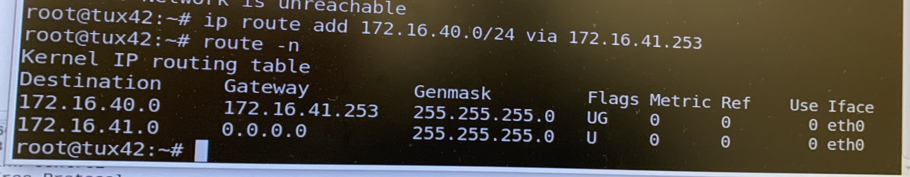
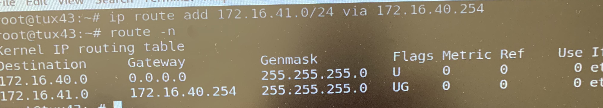
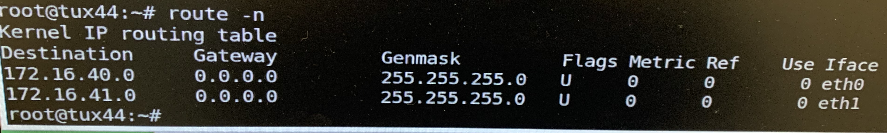
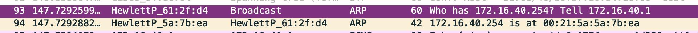
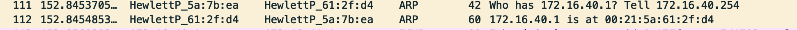
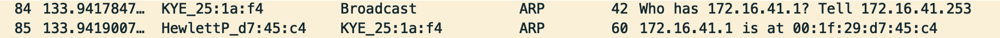
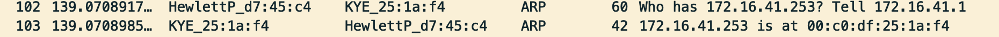

## **1.(Linux) What routes are there in the tuxes? What are their meaning?**

Routes defined the path for two machines to connect to each other. For example:

- To reach TUX2 through the connection to TUX4
´´´sh
ip route add 172.16.41.0/24 via 172.16.40.254
´´´

- To reach TUX3 through the connection to TUX4
´´´sh
ip route add 172.16.40.0/24 via 172.16.41.253
´´´

Routes:

-TUX2

-TUX3

-TUX4

## **2.(Linux) What information does an entry of the forwarding table contain?**

**TODO acabar**
- Destination - Specifies the host.
- Gateway - Specifies the gateway.
- Genmask - 
- Flags
- Metric - Specifies the metric
- Ref
- Use 
- Interface - The interface number for the specified route.

## **3.(Linux) What ARP messages, and associated MAC addresses, are observed and why?**

Because the network configuration was done in different interfaces, the ARP messages can be divided along that interface difference (eth0 - TUX3 e eth1 - TUX2)

- Captured in TUX4 in eth0

- Captured in TUX4 in eth1

## **4.(Linux) What are the IP and MAC addresses associated to ICMP packets and why?**

Because the network configuration was done in different interfaces, the ICMP messages can be divided along that interface difference (eth0 - TUX3 e eth1 - TUX2)

-eth0

IP and MAC address associated with TUX3 e TUX4

-eth1

IP and MAC address associated with TUX2 e TUX4

**5.(Cisco) What are the paths followed by the packets in the experiments carried out and why?**